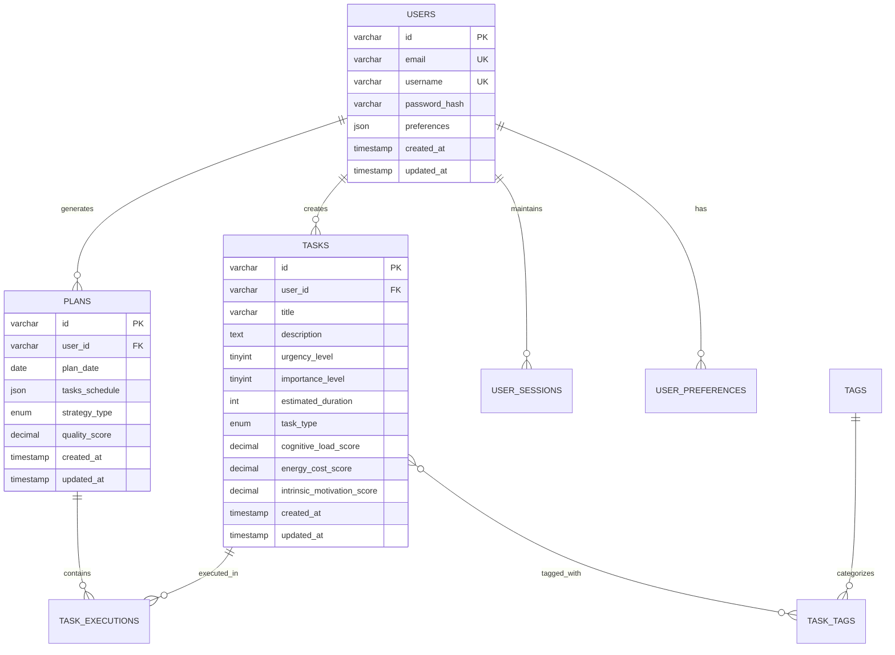

# 智能计划助手数据库设计文档

## 1. 文档概述

### 1.1 文档目的
本文档定义智能计划助手系统的数据库设计方案，包括数据模型、表结构、索引策略、安全设计和性能优化方案，为数据库开发、维护和优化提供技术指导。

### 1.2 设计原则
- **数据一致性**：保证业务数据的完整性和一致性
- **性能优先**：通过合理的索引和分表策略优化查询性能
- **可扩展性**：支持数据量增长和业务功能扩展
- **安全性**：保护用户敏感数据，符合隐私保护法规

### 1.3 数据库选型
| 数据库类型   | 技术选型     | 用途                   |
| ------------ | ------------ | ---------------------- |
| 关系型数据库 | MySQL 8.0+   | 核心业务数据存储       |
| 缓存数据库   | Redis 6.0+   | 会话缓存、热点数据缓存 |
| 文档数据库   | MongoDB 5.0+ | 行为分析数据、日志数据 |

## 2. 概念结构设计

### 2.1 核心实体关系图



## 3. 逻辑结构设计

### 3.1 用户管理模块

#### 用户表 (users)
```sql
CREATE TABLE users (
    id VARCHAR(36) PRIMARY KEY,
    email VARCHAR(255) UNIQUE NOT NULL,
    username VARCHAR(100) UNIQUE NOT NULL,
    password_hash VARCHAR(255) NOT NULL,
    first_name VARCHAR(100),
    last_name VARCHAR(100),
    timezone VARCHAR(50) DEFAULT 'UTC',
    language VARCHAR(10) DEFAULT 'zh-CN',
    preferences JSON,
    account_status ENUM('ACTIVE', 'INACTIVE', 'SUSPENDED') DEFAULT 'ACTIVE',
    email_verified BOOLEAN DEFAULT FALSE,
    last_login_at TIMESTAMP NULL,
    created_at TIMESTAMP DEFAULT CURRENT_TIMESTAMP,
    updated_at TIMESTAMP DEFAULT CURRENT_TIMESTAMP ON UPDATE CURRENT_TIMESTAMP
) ENGINE=InnoDB DEFAULT CHARSET=utf8mb4 COLLATE=utf8mb4_unicode_ci;
```

#### 用户会话表 (user_sessions)
```sql
CREATE TABLE user_sessions (
    id VARCHAR(36) PRIMARY KEY,
    user_id VARCHAR(36) NOT NULL,
    token VARCHAR(512) NOT NULL,
    device_info JSON,
    ip_address VARCHAR(45),
    user_agent TEXT,
    expires_at TIMESTAMP NOT NULL,
    last_activity_at TIMESTAMP DEFAULT CURRENT_TIMESTAMP,
    created_at TIMESTAMP DEFAULT CURRENT_TIMESTAMP,
    FOREIGN KEY (user_id) REFERENCES users(id) ON DELETE CASCADE,
    INDEX idx_user_id (user_id),
    INDEX idx_expires_at (expires_at)
);
```

#### 用户偏好表 (user_preferences)
```sql
CREATE TABLE user_preferences (
    id VARCHAR(36) PRIMARY KEY,
    user_id VARCHAR(36) NOT NULL UNIQUE,
    daily_start_time TIME DEFAULT '09:00:00',
    daily_end_time TIME DEFAULT '18:00:00',
    work_days JSON DEFAULT '["MON", "TUE", "WED", "THU", "FRI"]',
    break_duration_minutes INT DEFAULT 15,
    max_daily_work_hours INT DEFAULT 8,
    preferred_strategy ENUM('EFFICIENCY', 'HEALTH', 'FLOW', 'MOTIVATION') DEFAULT 'EFFICIENCY',
    cognitive_load_threshold DECIMAL(3,2) DEFAULT 0.7,
    energy_balance_priority DECIMAL(3,2) DEFAULT 0.5,
    created_at TIMESTAMP DEFAULT CURRENT_TIMESTAMP,
    updated_at TIMESTAMP DEFAULT CURRENT_TIMESTAMP ON UPDATE CURRENT_TIMESTAMP,
    FOREIGN KEY (user_id) REFERENCES users(id) ON DELETE CASCADE
);
```

### 3.2 任务管理模块

#### 任务表 (tasks)
```sql
CREATE TABLE tasks (
    id VARCHAR(36) PRIMARY KEY,
    user_id VARCHAR(36) NOT NULL,
    title VARCHAR(255) NOT NULL,
    description TEXT,
    urgency_level TINYINT CHECK (urgency_level BETWEEN 1 AND 5),
    importance_level TINYINT CHECK (importance_level BETWEEN 1 AND 5),
    estimated_duration INT NOT NULL COMMENT '预计时长(分钟)',
    task_type ENUM('CREATIVE', 'REPETITIVE', 'LEARNING', 'PHYSICAL', 'MEETING') NOT NULL,
    cognitive_load_score DECIMAL(3,2) CHECK (cognitive_load_score BETWEEN 0 AND 1),
    energy_cost_score DECIMAL(3,2) CHECK (energy_cost_score BETWEEN 0 AND 1),
    intrinsic_motivation_score DECIMAL(3,2) CHECK (intrinsic_motivation_score BETWEEN 0 AND 1),
    context_switch_cost DECIMAL(3,2) CHECK (context_switch_cost BETWEEN 0 AND 1),
    procrastination_tendency DECIMAL(3,2) CHECK (procrastination_tendency BETWEEN 0 AND 1),
    deadline DATE NULL,
    status ENUM('PENDING', 'IN_PROGRESS', 'COMPLETED', 'CANCELLED') DEFAULT 'PENDING',
    completed_at TIMESTAMP NULL,
    created_at TIMESTAMP DEFAULT CURRENT_TIMESTAMP,
    updated_at TIMESTAMP DEFAULT CURRENT_TIMESTAMP ON UPDATE CURRENT_TIMESTAMP,
    FOREIGN KEY (user_id) REFERENCES users(id) ON DELETE CASCADE,
    INDEX idx_user_id (user_id),
    INDEX idx_user_status (user_id, status),
    INDEX idx_urgency (urgency_level),
    INDEX idx_importance (importance_level),
    INDEX idx_deadline (deadline),
    INDEX idx_created_at (created_at)
);
```

#### 任务标签表 (tags)
```sql
CREATE TABLE tags (
    id VARCHAR(36) PRIMARY KEY,
    user_id VARCHAR(36) NOT NULL,
    name VARCHAR(100) NOT NULL,
    color VARCHAR(7) DEFAULT '#666666',
    created_at TIMESTAMP DEFAULT CURRENT_TIMESTAMP,
    FOREIGN KEY (user_id) REFERENCES users(id) ON DELETE CASCADE,
    UNIQUE KEY uk_user_tag (user_id, name),
    INDEX idx_user_id (user_id)
);
```

#### 任务标签关联表 (task_tags)
```sql
CREATE TABLE task_tags (
    id VARCHAR(36) PRIMARY KEY,
    task_id VARCHAR(36) NOT NULL,
    tag_id VARCHAR(36) NOT NULL,
    created_at TIMESTAMP DEFAULT CURRENT_TIMESTAMP,
    FOREIGN KEY (task_id) REFERENCES tasks(id) ON DELETE CASCADE,
    FOREIGN KEY (tag_id) REFERENCES tags(id) ON DELETE CASCADE,
    UNIQUE KEY uk_task_tag (task_id, tag_id),
    INDEX idx_task_id (task_id),
    INDEX idx_tag_id (tag_id)
);
```

### 3.3 计划管理模块

#### 计划表 (plans)
```sql
CREATE TABLE plans (
    id VARCHAR(36) PRIMARY KEY,
    user_id VARCHAR(36) NOT NULL,
    plan_date DATE NOT NULL,
    tasks_schedule JSON NOT NULL,
    strategy_type ENUM('EFFICIENCY', 'HEALTH', 'FLOW', 'MOTIVATION') NOT NULL,
    quality_score DECIMAL(4,3) CHECK (quality_score BETWEEN 0 AND 1),
    total_scheduled_duration INT COMMENT '总计划时长(分钟)',
    total_breaks_duration INT COMMENT '总休息时长(分钟)',
    cognitive_load_avg DECIMAL(4,3),
    energy_cost_avg DECIMAL(4,3),
    plan_status ENUM('GENERATED', 'ADJUSTED', 'EXECUTING', 'COMPLETED') DEFAULT 'GENERATED',
    created_at TIMESTAMP DEFAULT CURRENT_TIMESTAMP,
    updated_at TIMESTAMP DEFAULT CURRENT_TIMESTAMP ON UPDATE CURRENT_TIMESTAMP,
    FOREIGN KEY (user_id) REFERENCES users(id) ON DELETE CASCADE,
    UNIQUE KEY uk_user_plan_date (user_id, plan_date),
    INDEX idx_user_id (user_id),
    INDEX idx_plan_date (plan_date),
    INDEX idx_strategy_type (strategy_type)
);
```

#### 任务执行记录表 (task_executions)
```sql
CREATE TABLE task_executions (
    id VARCHAR(36) PRIMARY KEY,
    task_id VARCHAR(36) NOT NULL,
    plan_id VARCHAR(36) NOT NULL,
    user_id VARCHAR(36) NOT NULL,
    scheduled_start TIMESTAMP NOT NULL,
    scheduled_end TIMESTAMP NOT NULL,
    actual_start TIMESTAMP NULL,
    actual_end TIMESTAMP NULL,
    completion_status ENUM('COMPLETED', 'PARTIAL', 'FAILED', 'SKIPPED') DEFAULT 'SKIPPED',
    completion_percentage TINYINT DEFAULT 0 CHECK (completion_percentage BETWEEN 0 AND 100),
    user_feedback_score TINYINT CHECK (user_feedback_score BETWEEN 1 AND 5),
    actual_duration INT COMMENT '实际执行时长(分钟)',
    interruption_count INT DEFAULT 0,
    notes TEXT,
    created_at TIMESTAMP DEFAULT CURRENT_TIMESTAMP,
    updated_at TIMESTAMP DEFAULT CURRENT_TIMESTAMP ON UPDATE CURRENT_TIMESTAMP,
    FOREIGN KEY (task_id) REFERENCES tasks(id) ON DELETE CASCADE,
    FOREIGN KEY (plan_id) REFERENCES plans(id) ON DELETE CASCADE,
    FOREIGN KEY (user_id) REFERENCES users(id) ON DELETE CASCADE,
    INDEX idx_task_id (task_id),
    INDEX idx_plan_id (plan_id),
    INDEX idx_user_id (user_id),
    INDEX idx_scheduled_start (scheduled_start),
    INDEX idx_completion_status (completion_status)
);
```

### 3.4 行为分析模块

#### 用户行为记录表 (user_behaviors)
```sql
CREATE TABLE user_behaviors (
    id VARCHAR(36) PRIMARY KEY,
    user_id VARCHAR(36) NOT NULL,
    event_type VARCHAR(100) NOT NULL,
    event_data JSON,
    page_url VARCHAR(500),
    user_agent TEXT,
    ip_address VARCHAR(45),
    session_id VARCHAR(36),
    created_at TIMESTAMP DEFAULT CURRENT_TIMESTAMP,
    FOREIGN KEY (user_id) REFERENCES users(id) ON DELETE CASCADE,
    INDEX idx_user_id (user_id),
    INDEX idx_event_type (event_type),
    INDEX idx_created_at (created_at)
);
```

#### 算法效果评估表 (algorithm_evaluations)
```sql
CREATE TABLE algorithm_evaluations (
    id VARCHAR(36) PRIMARY KEY,
    user_id VARCHAR(36) NOT NULL,
    plan_id VARCHAR(36) NOT NULL,
    strategy_type ENUM('EFFICIENCY', 'HEALTH', 'FLOW', 'MOTIVATION') NOT NULL,
    predicted_quality_score DECIMAL(4,3),
    actual_quality_score DECIMAL(4,3),
    user_adjustment_count INT DEFAULT 0,
    task_completion_rate DECIMAL(4,3),
    avg_completion_delay INT COMMENT '平均完成延迟(分钟)',
    user_satisfaction_score TINYINT CHECK (user_satisfaction_score BETWEEN 1 AND 5),
    evaluation_date DATE NOT NULL,
    created_at TIMESTAMP DEFAULT CURRENT_TIMESTAMP,
    FOREIGN KEY (user_id) REFERENCES users(id) ON DELETE CASCADE,
    FOREIGN KEY (plan_id) REFERENCES plans(id) ON DELETE CASCADE,
    INDEX idx_user_id (user_id),
    INDEX idx_evaluation_date (evaluation_date),
    INDEX idx_strategy_type (strategy_type)
);
```

## 4. 物理结构设计

### 4.1 存储引擎配置
```sql
-- 使用InnoDB存储引擎，支持事务和外键
SET DEFAULT_STORAGE_ENGINE = INNODB;

-- 配置InnoDB参数
SET GLOBAL innodb_buffer_pool_size = 2147483648; -- 2GB
SET GLOBAL innodb_log_file_size = 134217728; -- 128MB
SET GLOBAL innodb_flush_log_at_trx_commit = 2;
```

### 4.2 字符集配置
```sql
-- 设置数据库默认字符集
SET NAMES utf8mb4;
SET CHARACTER SET utf8mb4;
SET CHARACTER_SET_CONNECTION = utf8mb4;

-- 创建数据库时指定字符集
CREATE DATABASE IF NOT EXISTS smart_planning 
DEFAULT CHARACTER SET utf8mb4 
DEFAULT COLLATE utf8mb4_unicode_ci;
```

### 4.3 分区策略
```sql
-- 对任务执行记录表按月份分区
ALTER TABLE task_executions 
PARTITION BY RANGE (YEAR(scheduled_start)*100 + MONTH(scheduled_start)) (
    PARTITION p202401 VALUES LESS THAN (202402),
    PARTITION p202402 VALUES LESS THAN (202403),
    PARTITION p202403 VALUES LESS THAN (202404),
    PARTITION p202404 VALUES LESS THAN (202405),
    PARTITION p_future VALUES LESS THAN MAXVALUE
);

-- 对用户行为记录表按日期分区
ALTER TABLE user_behaviors 
PARTITION BY RANGE (TO_DAYS(created_at)) (
    PARTITION p2024q1 VALUES LESS THAN (TO_DAYS('2024-04-01')),
    PARTITION p2024q2 VALUES LESS THAN (TO_DAYS('2024-07-01')),
    PARTITION p2024q3 VALUES LESS THAN (TO_DAYS('2024-10-01')),
    PARTITION p2024q4 VALUES LESS THAN (TO_DAYS('2025-01-01')),
    PARTITION p_future VALUES LESS THAN MAXVALUE
);
```

## 5. 索引设计

### 5.1 核心业务查询索引
```sql
-- 用户任务查询优化
CREATE INDEX idx_user_tasks_composite ON tasks(user_id, status, created_at DESC);
CREATE INDEX idx_user_tasks_priority ON tasks(user_id, urgency_level DESC, importance_level DESC);

-- 计划查询优化
CREATE INDEX idx_user_plans_composite ON plans(user_id, plan_date DESC);
CREATE INDEX idx_plans_quality ON plans(quality_score DESC, plan_date DESC);

-- 任务执行分析优化
CREATE INDEX idx_execution_analysis ON task_executions(user_id, completion_status, scheduled_start);
CREATE INDEX idx_performance_tracking ON task_executions(task_id, actual_start, actual_end);

-- 行为数据分析优化
CREATE INDEX idx_behavior_analysis ON user_behaviors(user_id, event_type, created_at DESC);
```

### 5.2 全文索引
```sql
-- 为任务标题和描述添加全文索引
ALTER TABLE tasks ADD FULLTEXT ft_task_content (title, description);
```

## 6. 安全设计

### 6.1 数据加密
```sql
-- 使用MySQL内置加密函数保护敏感数据
CREATE FUNCTION encrypt_sensitive_data(data TEXT) 
RETURNS TEXT DETERMINISTIC
BEGIN
    -- 使用AES加密敏感数据
    RETURN TO_BASE64(AES_ENCRYPT(data, '${ENCRYPTION_KEY}'));
END;

CREATE FUNCTION decrypt_sensitive_data(encrypted_data TEXT) 
RETURNS TEXT DETERMINISTIC
BEGIN
    -- 解密数据
    RETURN AES_DECRYPT(FROM_BASE64(encrypted_data), '${ENCRYPTION_KEY}');
END;
```

### 6.2 数据库用户权限
```sql
-- 创建应用用户，限制权限
CREATE USER 'planning_app'@'%' IDENTIFIED BY '${STRONG_PASSWORD}';

-- 授予最小必要权限
GRANT SELECT, INSERT, UPDATE, DELETE ON smart_planning.* TO 'planning_app'@'%';
GRANT EXECUTE ON smart_planning.* TO 'planning_app'@'%';

-- 拒绝危险操作权限
REVOKE DROP, CREATE, ALTER ON smart_planning.* FROM 'planning_app'@'%';

-- 创建只读用户用于报表查询
CREATE USER 'planning_readonly'@'%' IDENTIFIED BY '${READONLY_PASSWORD}';
GRANT SELECT ON smart_planning.* TO 'planning_readonly'@'%';
```

### 6.3 审计日志
```sql
-- 创建数据变更审计表
CREATE TABLE data_audit_log (
    id VARCHAR(36) PRIMARY KEY,
    table_name VARCHAR(100) NOT NULL,
    record_id VARCHAR(36) NOT NULL,
    operation ENUM('INSERT', 'UPDATE', 'DELETE') NOT NULL,
    old_values JSON,
    new_values JSON,
    changed_by VARCHAR(36),
    changed_at TIMESTAMP DEFAULT CURRENT_TIMESTAMP,
    INDEX idx_table_record (table_name, record_id),
    INDEX idx_changed_at (changed_at)
);

-- 创建任务表变更触发器
DELIMITER //
CREATE TRIGGER audit_tasks_changes
    AFTER UPDATE ON tasks
    FOR EACH ROW
BEGIN
    INSERT INTO data_audit_log (id, table_name, record_id, operation, old_values, new_values, changed_by)
    VALUES (UUID(), 'tasks', NEW.id, 'UPDATE', 
            JSON_OBJECT('title', OLD.title, 'status', OLD.status),
            JSON_OBJECT('title', NEW.title, 'status', NEW.status),
            NEW.user_id);
END//
DELIMITER ;
```

## 7. 性能优化策略

### 7.1 查询优化
```sql
-- 常用查询优化示例
-- 获取用户今日计划
EXPLAIN SELECT p.*, COUNT(te.id) as scheduled_tasks
FROM plans p
LEFT JOIN task_executions te ON p.id = te.plan_id
WHERE p.user_id = ? AND p.plan_date = CURDATE()
GROUP BY p.id;

-- 获取用户高优先级任务
EXPLAIN SELECT t.*, GROUP_CONCAT(tg.name) as tags
FROM tasks t
LEFT JOIN task_tags tt ON t.id = tt.task_id
LEFT JOIN tags tg ON tt.tag_id = tg.id
WHERE t.user_id = ? 
  AND t.status = 'PENDING'
  AND (t.urgency_level >= 4 OR t.importance_level >= 4)
GROUP BY t.id
ORDER BY t.urgency_level DESC, t.importance_level DESC;
```

### 7.2 数据库参数调优
```sql
-- 性能相关参数配置
SET GLOBAL query_cache_size = 134217728; -- 128MB
SET GLOBAL query_cache_type = 1;
SET GLOBAL max_connections = 500;
SET GLOBAL thread_cache_size = 32;
SET GLOBAL table_open_cache = 2000;

-- InnoDB优化
SET GLOBAL innodb_buffer_pool_instances = 4;
SET GLOBAL innodb_read_io_threads = 8;
SET GLOBAL innodb_write_io_threads = 8;
```

## 8. 备份与恢复策略

### 8.1 备份策略
```sql
-- 使用MySQL dump进行逻辑备份
-- 完整备份（每日）
mysqldump --single-transaction --routines --triggers \
  --databases smart_planning > /backups/full_backup_$(date +%Y%m%d).sql

-- 增量备份（使用二进制日志）
-- 在my.cnf中启用二进制日志
[mysqld]
server-id = 1
log_bin = /var/log/mysql/mysql-bin.log
expire_logs_days = 7
max_binlog_size = 100M
```

### 8.2 恢复流程
```sql
-- 完整恢复流程
-- 1. 停止应用服务
-- 2. 恢复完整备份
mysql < /backups/full_backup_20241219.sql

-- 3. 应用增量备份
mysqlbinlog /var/log/mysql/mysql-bin.000001 | mysql

-- 4. 验证数据完整性
-- 5. 重启应用服务
```

## 9. 监控与维护

### 9.1 性能监控
```sql
-- 关键性能指标查询
-- 查询缓存命中率
SELECT SUM(HITS) / (SUM(HITS) + SUM(INSERTS)) * 100 as hit_rate
FROM INFORMATION_SCHEMA.QUERY_CACHE;

-- 索引使用统计
SELECT TABLE_NAME, INDEX_NAME, ROWS_READ
FROM INFORMATION_SCHEMA.INDEX_STATISTICS
WHERE TABLE_SCHEMA = 'smart_planning';

-- 慢查询分析
SELECT * FROM mysql.slow_log 
WHERE start_time > NOW() - INTERVAL 1 HOUR
ORDER BY query_time DESC LIMIT 10;
```

### 9.2 维护任务
```sql
-- 定期优化表
OPTIMIZE TABLE tasks, plans, task_executions;

-- 更新统计信息
ANALYZE TABLE tasks, plans, task_executions, user_behaviors;

-- 清理过期数据
DELETE FROM user_sessions WHERE expires_at < NOW();
DELETE FROM data_audit_log WHERE changed_at < NOW() - INTERVAL 90 DAY;
```

## 10. 数据迁移与版本控制

### 10.1 Flyway迁移脚本
```sql
-- V1__Create_initial_schema.sql
-- 包含所有基础表的创建脚本

-- V2__Add_behavioral_attributes.sql
ALTER TABLE tasks 
ADD COLUMN context_switch_cost DECIMAL(3,2),
ADD COLUMN procrastination_tendency DECIMAL(3,2);

-- V3__Add_analytics_tables.sql
-- 创建分析相关表

-- V4__Add_indexes_for_performance.sql
-- 添加性能优化索引
```

### 10.2 数据初始化
```sql
-- 初始化系统配置数据
INSERT INTO system_config (config_key, config_value, description) VALUES
('algorithm.weights.efficiency', '{"completion":0.4,"stability":0.2,"cognitive":0.2,"energy":0.1,"behavior":0.1}', '效率优先策略权重'),
('algorithm.weights.health', '{"completion":0.2,"stability":0.2,"cognitive":0.1,"energy":0.4,"behavior":0.1}', '健康平衡策略权重'),
('system.defaults.cognitive_threshold', '0.75', '默认认知负荷阈值');
```

## 11. 容灾与高可用

### 11.1 主从复制配置
```sql
-- 主库配置
[mysqld]
server-id = 1
log_bin = mysql-bin
binlog_format = ROW
gtid_mode = ON
enforce_gtid_consistency = ON

-- 从库配置
[mysqld]
server-id = 2
relay_log = mysql-relay-bin
read_only = ON
```

### 11.2 故障转移策略
```sql
-- 监控主库状态
SHOW SLAVE STATUS\G

-- 手动故障转移流程
-- 1. 停止从库复制
STOP SLAVE;

-- 2. 提升从库为主库
RESET SLAVE ALL;

-- 3. 更新应用连接配置
```

---

**文档信息**
- **版本**：v1.0
- **最后更新**：2024年12月19日
- **下次评审**：2025年1月19日
- **编写人**：数据库管理员
- **批准人**：技术负责人、架构师

**变更记录**
| 版本 | 日期       | 变更内容     | 变更人  |
| ---- | ---------- | ------------ | ------- |
| v1.0 | 2024-12-19 | 初始版本创建 | DBA团队 |