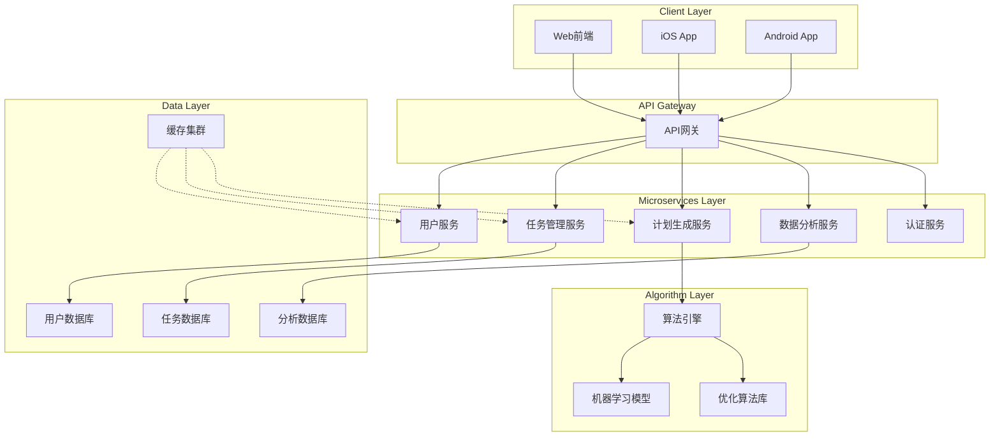

# 智能计划助手软件概要设计文档

## 1. 系统概述

### 1.1 项目背景
基于行为科学研究成果，开发具有创新性的智能计划助手，解决传统任务管理工具的局限性，提供真正个性化、科学化的计划生成服务。

### 1.2 设计目标
- 构建高可用、可扩展的微服务架构
- 实现基于行为科学的多目标优化算法引擎
- 提供跨平台一致的用户体验
- 保障用户数据安全和隐私保护
- 支持快速迭代和功能扩展

### 1.3 设计原则
- **模块化设计**：各功能模块独立开发、部署和扩展
- **松耦合架构**：服务间通过明确定义的API通信
- **数据驱动**：基于用户行为数据持续优化算法
- **用户体验优先**：直观的界面设计和流畅的交互体验

## 2. 系统架构设计

### 2.1 整体架构图



### 2.2 技术栈选择

#### 前端技术栈
- **Web端**：Vue 3 + TypeScript + Pinia + Vite
- **移动端**：React Native + TypeScript
- **UI组件库**：Element Plus (Web) + React Native Elements

#### 后端技术栈
- **API网关**：Node.js + Express
- **核心服务**：Python + FastAPI
- **算法服务**：Python + NumPy + SciPy + C++ (性能关键部分)
- **数据库**：MySQL (主数据) + Redis (缓存) + MongoDB (分析数据)
- **消息队列**：RabbitMQ

#### 基础设施
- **容器化**：Docker + Kubernetes
- **CI/CD**：Jenkins + GitLab CI
- **监控**：Prometheus + Grafana + ELK Stack
- **云平台**：AWS/Aliyun

## 3. 核心模块设计

### 3.1 用户服务模块

#### 功能职责
- 用户注册、登录、身份验证
- 用户偏好设置管理
- 个人信息和安全设置

#### 接口设计
```python
class UserService:
    def register_user(user_data: UserRegistration) -> User
    def authenticate(credentials: LoginRequest) -> AuthToken
    def update_preferences(user_id: str, preferences: UserPreferences) -> User
    def get_user_profile(user_id: str) -> UserProfile
```

### 3.2 任务管理模块

#### 功能职责
- 任务的CRUD操作
- 任务属性量化评估
- 任务分类和标签管理

#### 数据模型
```sql
CREATE TABLE tasks (
    id VARCHAR(36) PRIMARY KEY,
    user_id VARCHAR(36) NOT NULL,
    title VARCHAR(255) NOT NULL,
    description TEXT,
    urgency_level TINYINT, -- 1-5
    importance_level TINYINT, -- 1-5
    estimated_duration INT, -- 分钟
    task_type ENUM('creative', 'repetitive', 'learning'),
    cognitive_load_score DECIMAL(3,2),
    energy_cost_score DECIMAL(3,2),
    intrinsic_motivation_score DECIMAL(3,2),
    created_at TIMESTAMP,
    updated_at TIMESTAMP
);
```

### 3.3 计划生成模块

#### 核心算法架构
```python
class PlanningAlgorithm:
    def generate_plan(self, tasks: List[Task], strategy: StrategyType) -> Plan:
        # 多目标优化：Q = α·C + β·S + γ·(1-L) + δ·E + ε·B
        objectives = self.calculate_objectives(tasks)
        optimized_schedule = self.optimize_schedule(objectives, strategy)
        return self.format_plan(optimized_schedule)
    
    def calculate_objectives(self, tasks: List[Task]) -> Objectives:
        return Objectives(
            completion_priority = self.calculate_completion_priority(tasks),
            schedule_stability = self.calculate_schedule_stability(tasks),
            cognitive_load = self.calculate_cognitive_load(tasks),
            energy_balance = self.calculate_energy_balance(tasks),
            behavioral_factors = self.calculate_behavioral_factors(tasks)
        )
```

#### 优化策略实现
- **效率优先型**：最大化高重要性任务完成率
- **健康平衡型**：最小化每日总能量消耗峰值
- **心流促进型**：最大化连续工作时段
- **动机维持型**：平衡高低愉悦度任务分布

### 3.4 数据分析模块

#### 功能职责
- 用户行为数据收集和分析
- 算法效果评估和优化
- 个性化推荐生成

#### 数据处理流程
```
数据收集 → 数据清洗 → 特征工程 → 模型训练 → 效果评估 → 服务集成
```

## 4. 数据库设计

### 4.1 主要数据表

#### 用户相关表
```sql
-- 用户表
CREATE TABLE users (
    id VARCHAR(36) PRIMARY KEY,
    email VARCHAR(255) UNIQUE NOT NULL,
    username VARCHAR(100) UNIQUE NOT NULL,
    password_hash VARCHAR(255) NOT NULL,
    preferences JSON,
    created_at TIMESTAMP DEFAULT CURRENT_TIMESTAMP
);

-- 用户会话表
CREATE TABLE user_sessions (
    id VARCHAR(36) PRIMARY KEY,
    user_id VARCHAR(36) NOT NULL,
    token VARCHAR(512) NOT NULL,
    expires_at TIMESTAMP NOT NULL,
    created_at TIMESTAMP DEFAULT CURRENT_TIMESTAMP
);
```

#### 任务和计划表
```sql
-- 任务表（见3.2节）
-- 计划表
CREATE TABLE plans (
    id VARCHAR(36) PRIMARY KEY,
    user_id VARCHAR(36) NOT NULL,
    plan_date DATE NOT NULL,
    tasks_schedule JSON NOT NULL, -- 序列化的任务安排
    strategy_type ENUM('efficiency', 'health', 'flow', 'motivation'),
    quality_score DECIMAL(4,3),
    created_at TIMESTAMP DEFAULT CURRENT_TIMESTAMP
);

-- 任务执行记录表
CREATE TABLE task_executions (
    id VARCHAR(36) PRIMARY KEY,
    task_id VARCHAR(36) NOT NULL,
    plan_id VARCHAR(36) NOT NULL,
    scheduled_start TIMESTAMP NOT NULL,
    actual_start TIMESTAMP,
    actual_end TIMESTAMP,
    completion_status ENUM('completed', 'partial', 'failed', 'skipped'),
    user_feedback_score TINYINT, -- 1-5
    notes TEXT
);
```

## 5. 接口设计

### 5.1 REST API 设计

#### 用户接口
```
POST /api/v1/auth/register     # 用户注册
POST /api/v1/auth/login        # 用户登录
GET  /api/v1/users/me          # 获取用户信息
PUT  /api/v1/users/preferences # 更新用户偏好
```

#### 任务接口
```
GET    /api/v1/tasks           # 获取任务列表
POST   /api/v1/tasks           # 创建任务
PUT    /api/v1/tasks/{id}      # 更新任务
DELETE /api/v1/tasks/{id}      # 删除任务
POST   /api/v1/tasks/{id}/evaluate # 评估任务属性
```

#### 计划接口
```
POST /api/v1/plans/generate    # 生成计划
GET  /api/v1/plans/{date}      # 获取指定日期计划
PUT  /api/v1/plans/{id}        # 调整计划
POST /api/v1/plans/{id}/feedback # 提交计划反馈
```

### 5.2 第三方集成接口

#### 日历集成
```typescript
interface CalendarIntegration {
    syncToCalendar(plan: Plan, calendarType: 'google' | 'outlook'): Promise<void>;
    importEvents(calendarType: 'google' | 'outlook', dateRange: DateRange): Promise<Event[]>;
}
```

## 6. 安全设计

### 6.1 认证授权机制
- **JWT Token认证**：无状态认证，支持跨服务验证
- **RBAC权限模型**：基于角色的访问控制
- **OAuth 2.0集成**：支持第三方登录和日历集成

### 6.2 数据安全
```python
# 数据加密示例
class DataEncryption:
    def encrypt_sensitive_data(self, data: str) -> str:
        # 使用AES-256加密敏感数据
        pass
    
    def decrypt_sensitive_data(self, encrypted_data: str) -> str:
        # 解密数据
        pass
```

### 6.3 API安全
- **HTTPS强制传输**：所有API通信加密
- **API限流**：防止滥用和DDoS攻击
- **输入验证**：严格的参数校验和SQL注入防护

## 7. 性能与扩展性设计

### 7.1 性能优化策略

#### 缓存策略
```python
class CacheManager:
    def __init__(self):
        self.redis_client = redis.Redis(host='redis', port=6379)
    
    def get_user_tasks(self, user_id: str) -> List[Task]:
        cache_key = f"user_tasks:{user_id}"
        cached = self.redis_client.get(cache_key)
        if cached:
            return json.loads(cached)
        # 从数据库获取并缓存
        tasks = self.fetch_tasks_from_db(user_id)
        self.redis_client.setex(cache_key, 300, json.dumps(tasks))
        return tasks
```

#### 数据库优化
- **读写分离**：主从复制架构
- **分库分表**：按用户ID分片
- **索引优化**：针对常用查询字段建立索引

### 7.2 扩展性设计

#### 水平扩展
- **无状态服务**：支持多实例部署
- **负载均衡**：基于Nginx/HAProxy的流量分发
- **数据库分片**：支持数据水平拆分

#### 微服务治理
```yaml
# Kubernetes服务配置示例
apiVersion: apps/v1
kind: Deployment
metadata:
  name: plan-generation-service
spec:
  replicas: 3
  selector:
    matchLabels:
      app: plan-generation
  template:
    metadata:
      labels:
        app: plan-generation
    spec:
      containers:
      - name: plan-generation
        image: plan-service:latest
        resources:
          requests:
            memory: "256Mi"
            cpu: "250m"
          limits:
            memory: "512Mi"
            cpu: "500m"
```

## 8. 监控与运维

### 8.1 监控指标
- **应用性能**：响应时间、错误率、吞吐量
- **系统资源**：CPU、内存、磁盘、网络
- **业务指标**：用户活跃度、任务完成率、算法准确率

### 8.2 日志系统
```python
import structlog

logger = structlog.get_logger()

class PlanGenerationService:
    def generate_plan(self, user_id: str, tasks: List[Task]) -> Plan:
        logger.info("plan_generation_start", user_id=user_id, task_count=len(tasks))
        try:
            plan = self.algorithm.generate_plan(tasks)
            logger.info("plan_generation_success", user_id=user_id, plan_id=plan.id)
            return plan
        except Exception as e:
            logger.error("plan_generation_failed", user_id=user_id, error=str(e))
            raise
```

### 8.3 告警机制
- **实时告警**：关键错误和性能异常
- **趋势预警**：容量规划和性能退化预警
- **业务告警**：核心业务指标异常波动

## 9. 部署架构

### 9.1 环境规划
- **开发环境**：功能开发和单元测试
- **测试环境**：集成测试和用户验收
- **预生产环境**：性能测试和安全验证
- **生产环境**：用户正式使用

### 9.2 部署流程
```
代码提交 → 自动化测试 → 镜像构建 → 环境部署 → 健康检查 → 流量切换
```

## 10. 风险评估与应对

### 10.1 技术风险
- **算法效果风险**：建立A/B测试框架，持续优化
- **性能风险**：压力测试和性能调优
- **安全风险**：定期安全审计和渗透测试

### 10.2 应对策略
- **降级方案**：核心功能降级保证基本可用性
- **回滚机制**：快速回滚到稳定版本
- **容灾备份**：多地域部署和数据备份

---

## 附录

### A. 技术依赖清单
- Python 3.9+
- Node.js 16+
- MySQL 8.0+
- Redis 6.0+
- Docker 20.0+
- Kubernetes 1.25+

### B. 开发规范
- 代码规范：遵循PEP 8 (Python)和ESLint (JavaScript)
- API文档：使用OpenAPI 3.0规范
- 测试要求：单元测试覆盖率 > 80%
- 代码审查：所有代码必须经过同行评审

### C. 版本规划
- **v1.0 (MVP)**：基础任务管理和计划生成
- **v1.5**：心理属性评估和移动端支持
- **v2.0**：团队协作和企业版功能

---

**文档信息**
- **版本**：v1.0
- **最后更新**：2024年12月19日
- **下次评审**：2025年1月19日
- **编写人**：架构师团队
- **批准人**：技术负责人、产品负责人