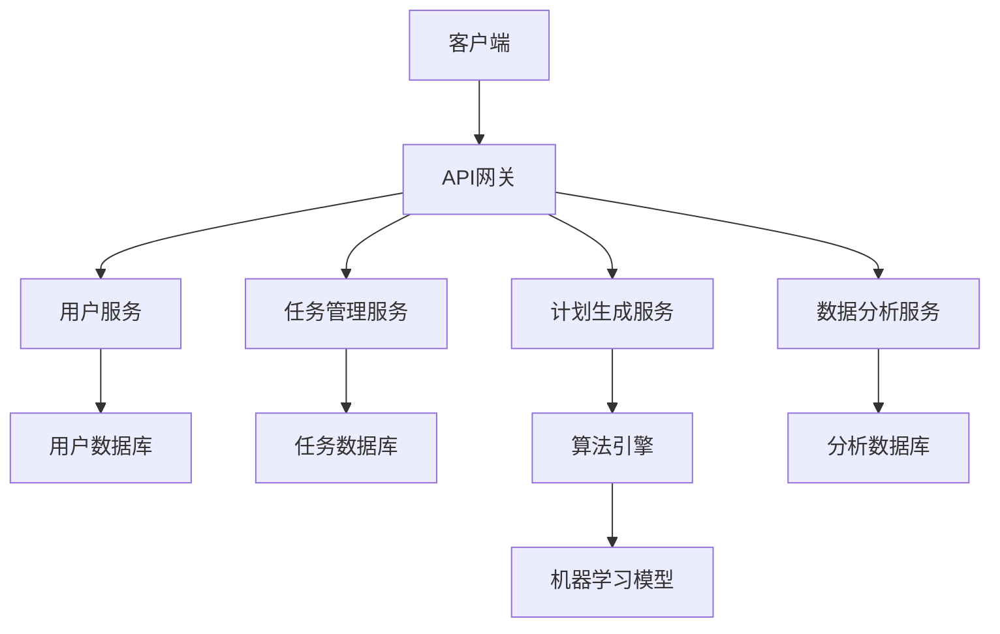
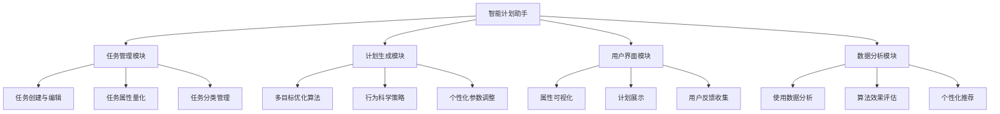
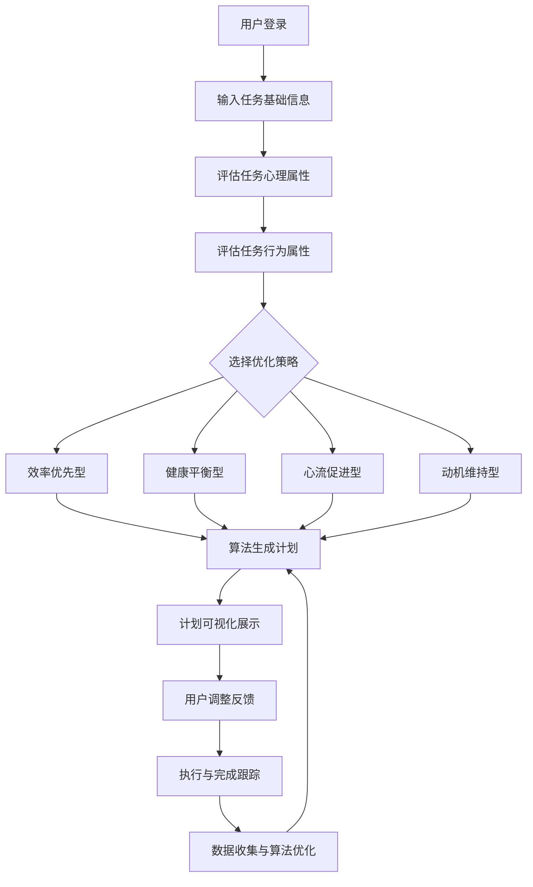

# 智能计划助手软件需求分析文档

## 第1章 序言

本文档旨在定义"智能计划助手"产品的软件需求规格，基于行为科学研究成果和用户访谈反馈，为开发团队提供明确的技术指导和功能规范。

## 第2章 引言

### 项目概述

#### 项目背景
随着个人任务管理复杂度增加，传统工具无法满足用户对个性化、智能化计划的需求。现有产品大多只关注基础任务属性，忽视了心理和行为因素对计划执行的影响。

#### 项目目标
- 开发基于行为科学理论的智能计划生成系统
- 实现任务要素的多维度量化建模
- 提供个性化、可执行的智能计划推荐
- 在学生和职场人士群体中快速占领市场

### 编写目的
明确系统功能需求、技术要求和用户体验标准，确保开发过程与研究成果和用户需求保持一致。

### 文档约定
- **必须**：核心功能，MVP版本必须实现
- **应该**：重要功能，建议在MVP中实现
- **可以**：增强功能，可在后续版本实现

### 预期读者及阅读建议
- **开发团队**：重点关注第3、4章的技术要求和功能设计
- **产品经理**：关注第4章的功能需求和用户体验设计
- **测试团队**：基于本文档制定测试用例
- **管理层**：了解项目整体架构和商业模式

## 第3章 技术要求

### 软件开发要求

#### 接口要求
- 必须提供RESTful API接口
- 应该支持与主流日历应用集成（Google Calendar、Outlook等）
- 必须提供Web前端和移动端接口

#### 系统专有技术
- 必须实现多目标优化算法框架
- 应该采用机器学习方法进行个性化参数调优
- 可以探索深度学习用于任务属性自动推断

#### 查询功能
- 必须支持多维度任务查询和筛选
- 应该提供实时计划调整和影响分析

#### 数据安全
- 必须对用户数据进行加密存储
- 应该符合GDPR等数据保护法规

#### 可靠性要求
- 系统可用性不低于99.5%
- 计划生成成功率不低于98%

#### 稳定性要求
- 支持并发用户数≥10000
- 7×24小时不间断服务

#### 先进性要求
- 采用微服务架构，支持弹性扩展
- 使用容器化部署

#### 扩展性要求
- 必须支持后续团队协作功能扩展
- 应该预留企业版功能接口

## 第4章 项目建设内容

### 项目需求概述

#### 项目管理需求
- 采用敏捷开发方法，支持快速迭代
- 建立持续集成/持续部署流水线

#### 功能框架图

#### 业务流程图

### 核心功能需求

#### 任务要素量化系统（必须）
1. **基础属性层**
   - 任务名称、描述
   - 紧迫性（5级行为锚定量表）
   - 重要性（目标关联性评估）
   - 预期耗时
   - 任务类型（创造性/重复性/学习型）

2. **心理属性层**
   - 认知负荷评估（NASA-TXL简化版）
   - 能量消耗量表
   - 上下文切换成本推断
   - 内在动机/愉悦度评估

3. **行为属性层**
   - 执行承诺度量表
   - 启动门槛评估
   - 拖延倾向测量

#### 智能计划生成（必须）
- 多目标优化算法：Q = α·C + β·S + γ·(1-L) + δ·E + ε·B
- 四种优化策略选择：
  - 效率优先型：最大化高重要性任务完成率
  - 健康平衡型：最小化每日总能量消耗峰值
  - 心流促进型：最大化连续工作时段
  - 动机维持型：平衡高低愉悦度任务分布

#### 用户界面系统（必须）
- 任务属性可视化（图标+颜色编码）
- 引导性评估问题
- 渐进式属性收集
- 多视角计划展示（日视图、周视图、专注视图）
- 计划调整实时影响分析

## 第5章 系统安全需求

### 物理设计安全
- 采用云服务提供商的安全基础设施
- 实现数据异地备份

### 系统安全设计
- 必须实现用户身份认证和授权
- 应该支持多因素认证

### 网络安全设计
- 必须使用HTTPS加密传输
- 应该实现API访问频率限制

### 应用安全设计
- 必须实现用户数据隔离
- 应该对敏感操作进行日志记录

### 数据安全管理
- 必须对用户个人信息进行加密存储
- 应该定期进行安全漏洞扫描

## 第6章 其他非功能需求

### 性能设计
- 计划生成响应时间：< 3秒
- 页面加载时间：< 2秒

### 稳定性设计
- 系统平均无故障时间：> 720小时
- 数据备份恢复时间：< 4小时

### 兼容性设计
- 必须支持Chrome、Firefox、Safari主流浏览器
- 应该提供iOS和Android移动应用

### 易操作性设计
- 新用户上手时间：< 10分钟
- 任务添加操作步骤：≤ 3步

### 可维护性设计
- 必须提供完整的系统文档
- 应该实现模块化设计，支持独立部署和升级

---

## 附录：MVP版本优先级

### 第一阶段（必须实现）
1. 基础任务属性收集和量化
2. 多目标优化算法核心框架
3. 基础用户界面和计划可视化

### 第二阶段（应该实现）
1. 心理和行为属性评估系统
2. 个性化策略选择界面
3. 与日历系统集成

### 第三阶段（可以实现）
1. 高级数据分析报表
2. 团队协作功能
3. 企业版管理功能

---

**文档版本**：v1.0  
**最后更新**：2024年12月19日  
**下次评审**：2025年1月19日