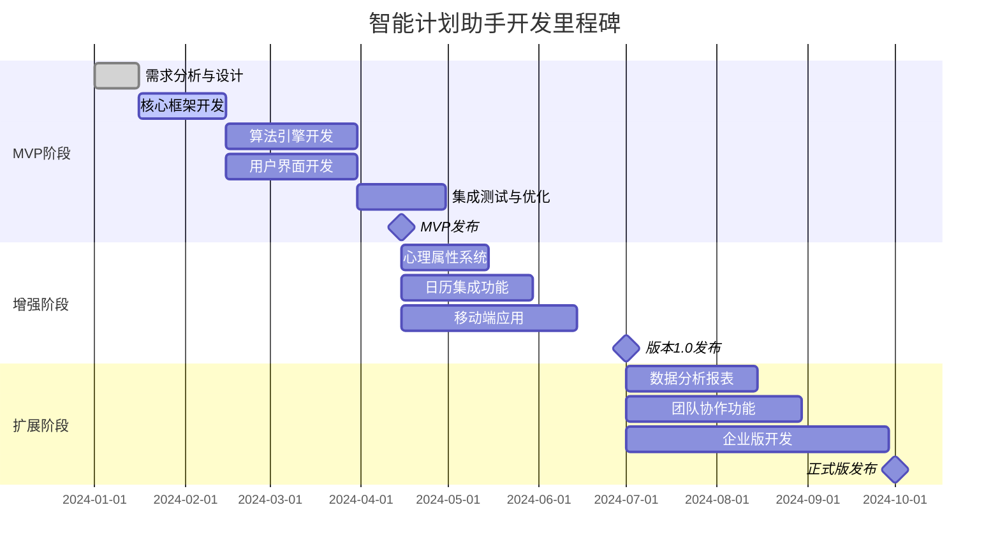

# 智能计划助手项目开发计划

## 1. 项目概述

### 1.1 项目背景
基于行为科学研究成果，开发具有创新性的智能计划助手，解决传统任务管理工具的局限性，提供真正个性化、科学化的计划生成服务。

### 1.2 项目目标
- **短期目标（3个月）**：完成MVP开发，在学生和职场人士群体中获得10万注册用户
- **中期目标（6个月）**：实现产品市场匹配，建立稳定的用户增长机制
- **长期目标（12个月）**：推出企业版，建立完整的商业模式

### 1.3 项目范围
**MVP范围**：
- 个人任务管理核心功能
- 任务要素量化系统
- 智能计划生成算法
- 基础用户界面

**排除范围**：
- 团队协作功能
- 企业级管理功能
- 高级数据分析报表

## 2. 项目里程碑



## 3. 开发阶段详细计划

### 3.1 第一阶段：MVP开发（第1-3个月）

#### 迭代1：基础框架搭建（第1-2周）
**目标**：建立技术栈和基础架构
- [ ] 确定技术选型（前端：Vue3 + TypeScript，后端：Node.js + Python[性能部分C++ + pybind11]，数据库: MySQL，缓存: Redis，接口: GraphQL/REST API）
- [ ] 搭建微服务架构
- [ ] 设计数据库 schema
- [ ] 实现用户认证系统
- [ ] 建立CI/CD流水线

**交付物**：
- 技术架构文档
- 基础运行环境
- 用户注册/登录功能

#### 迭代2：任务管理系统（第3-6周）
**目标**：实现核心任务管理功能
- [ ] 任务CRUD操作
- [ ] 基础属性收集（名称、截止日期、预估耗时、紧迫度）
- [ ] 任务分类管理
- [ ] 数据持久化层

**交付物**：
- 完整的任务管理模块
- 基础属性量化系统

#### 迭代3：算法引擎开发（第7-10周）
**目标**：实现智能计划生成核心算法
- [ ] 多目标优化算法框架
- [ ] 四种优化策略实现
- [ ] 任务规划质量评估模型
- [ ] 算法测试和验证

**交付物**：
- 算法引擎核心代码
- 算法测试报告
- 性能基准测试

#### 迭代4：用户界面集成（第11-12周）
**目标**：完成端到端功能集成
- [ ] 任务属性可视化界面
- [ ] 计划展示视图（日视图、周视图）
- [ ] 用户反馈收集机制
- [ ] 端到端测试

**交付物**：
- 可用的Web应用
- 用户手册
- 部署文档

### 3.2 第二阶段：功能增强（第4-6个月）

#### 迭代5：心理属性系统（第13-16周）
**目标**：完善任务要素量化模型
- [ ] 认知负荷评估量表
- [ ] 能量消耗测量工具
- [ ] 内在动机评估
- [ ] 心理属性可视化

#### 迭代6：行为属性与个性化（第17-20周）
**目标**：实现行为科学驱动的个性化
- [ ] 执行承诺度评估
- [ ] 启动门槛测量
- [ ] 拖延倾向分析
- [ ] 个性化参数调优

#### 迭代7：移动端与集成（第21-24周）
**目标**：扩展平台覆盖和集成能力
- [ ] iOS/Android应用开发
- [ ] 日历系统集成
- [ ] 数据同步机制

### 3.3 第三阶段：商业化准备（第7-12个月）

#### 迭代8：数据分析与报表（第25-28周）
**目标**：实现数据驱动的洞察功能
- [ ] 使用数据分析仪表板
- [ ] 个性化洞察报告
- [ ] 算法效果监控

#### 迭代9：团队协作功能（第29-32周）
**目标**：扩展至团队使用场景
- [ ] 团队任务管理
- [ ] 权限管理系统
- [ ] 协作工作流

#### 迭代10：企业版开发（第33-40周）
**目标**：实现商业化功能
- [ ] 企业管理控制台
- [ ] 高级安全功能
- [ ] 计费系统集成
- [ ] SLA保障机制

## 4. 团队组织与资源配置

### 4.1 核心团队结构
```
项目经理 (1)
├── 产品经理 (1)
├── 技术负责人 (1)
├── 开发团队 (6)
│   ├── 前端开发 (2)
│   ├── 后端开发 (2)
│   ├── 算法工程师 (1)
│   └── 移动端开发 (1)
├── 测试团队 (2)
└── UI/UX设计师 (1)
```

### 4.2 关键角色职责
- **项目经理**：整体进度管理、风险控制、资源协调
- **产品经理**：需求管理、用户研究、产品路线图
- **技术负责人**：技术架构决策、代码质量保障
- **算法工程师**：核心算法研发、数学模型实现

### 4.3 工具栈
- **项目管理**：Jira + Confluence
- **代码管理**：Git + GitHub
- **持续集成**：Jenkins + Docker
- **监控**：Prometheus + Grafana
- **沟通**：Slack + Zoom

## 5. 风险管理计划

### 5.1 已识别风险及应对措施

| 风险类别 | 风险描述         | 概率 | 影响 | 应对措施                           |
| -------- | ---------------- | ---- | ---- | ---------------------------------- |
| 技术风险 | 算法效果不达预期 | 中   | 高   | 提前进行算法原型验证，准备备选方案 |
| 资源风险 | 关键人员流失     | 低   | 高   | 建立文档化流程，交叉培训           |
| 时间风险 | 功能开发延期     | 中   | 中   | 设置缓冲时间，优先级管理           |
| 市场风险 | 用户接受度低     | 中   | 高   | 早期用户测试，快速迭代优化         |
| 竞争风险 | 竞争对手快速模仿 | 高   | 中   | 建立技术壁垒，快速占领市场         |

### 5.2 风险监控机制
- 每周风险评审会议
- 关键指标监控（用户活跃度、任务完成率）
- 竞争对手动态跟踪
- 技术债务定期评估

## 6. 质量保障计划

### 6.1 质量标准
- **代码质量**：单元测试覆盖率 > 80%
- **性能标准**：页面加载时间 < 2秒，算法响应 < 3秒
- **可用性**：系统可用性 > 99.5%
- **安全性**：无高危安全漏洞

### 6.2 测试策略
- **单元测试**：每个业务逻辑模块
- **集成测试**：API接口和数据库操作
- **端到端测试**：关键用户流程
- **性能测试**：并发用户和算法性能
- **用户验收测试**：每个迭代结束前

## 7. 部署与发布计划

### 7.1 环境策略
- **开发环境**：功能开发验证
- **测试环境**：集成测试和用户验收
- **预生产环境**：性能测试和安全测试
- **生产环境**：用户正式使用

### 7.2 发布策略
- **MVP发布**：邀请制，核心用户群体
- **公开测试**：逐步扩大用户范围
- **正式发布**：全面开放注册
- **企业版发布**：定向销售推广

## 8. 成功度量指标

### 8.1 产品指标
- 注册用户数（目标：3个月10万）
- 日活跃用户率（目标：> 30%）
- 任务完成率（目标：比传统工具提升20%）
- 用户满意度（目标：NPS > 50）

### 8.2 技术指标
- 系统可用性（目标：> 99.5%）
- 算法准确率（目标：用户调整率 < 15%）
- 响应时间（目标：< 3秒）

### 8.3 业务指标
- 用户留存率（目标：30日留存 > 40%）
- 付费转化率（企业版目标：> 5%）
- 客户获取成本（目标：< ￥50/用户）

## 9. 预算与资源计划

### 9.1 人力资源预算
| 角色       | 人数   | 月成本        | 总成本（12个月） |
| ---------- | ------ | ------------- | ---------------- |
| 项目经理   | 1      | ￥25,000      | ￥300,000        |
| 开发工程师 | 6      | ￥120,000     | ￥1,440,000      |
| 测试工程师 | 2      | ￥30,000      | ￥360,000        |
| 产品/设计  | 2      | ￥40,000      | ￥480,000        |
| **合计**   | **11** | **￥215,000** | **￥2,580,000**  |

### 9.2 基础设施预算
- 云服务（AWS/Aliyun）：￥40,000/月
- 第三方服务：￥10,000/月
- 开发工具：￥5,000/月
- **年度基础设施总预算**：￥660,000

### 9.3 总预算
- **人力资源**：￥2,580,000
- **基础设施**：￥660,000
- **应急储备（15%）**：￥486,000
- **年度总预算**：￥3,726,000

## 10. 沟通计划

### 10.1 内部沟通
- **每日站会**：15分钟，团队同步
- **每周迭代会议**：2小时，进度评审和计划
- **月度评审**：项目状态和路线图更新

### 10.2 利益相关者沟通
- **双周进度报告**：向管理层汇报
- **月度演示**：产品功能展示
- **季度业务评审**：战略方向调整

---

**文档信息**
- **制定日期**：2024年12月19日
- **下次评审**：2025年1月19日
- **版本**：v1.0
- **批准人**：项目经理、产品负责人、技术负责人
